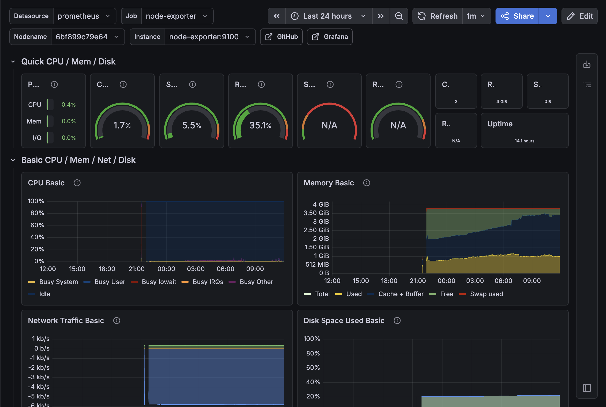

# AetherOps Engineering Lab
### A high-fidelity DevSecOps and Platform Engineering sandbox for modern cloud-native systems.
## Project Objective
The **AetherOps Engineering Lab** is a production-grade playground designed to simulate and demonstrate how modern, highly scalable companies architect, secure, deploy, and monitor cloud-native applications. 

This lab is a comprehensive showcase of modern platform engineering practices, integrating containerized environments, secure secrets loading, scalable orchestration, and granular observability.

---
**Live Documentation & Dashboard**: [https://aetherops-lab.vercel.app/](https://aetherops-lab.vercel.app/)

---
## Platform Architecture
The lab implements a robust, multi-layer secure architecture designed to guarantee reliable delivery, secure runtime, and rapid observability:
```
Internet ──► Nginx (Reverse Proxy / TLS) ──► Express API (Node.js 26) ──► PostgreSQL
```

### Core Architecture Highlights
- **Reverse Proxy**: Nginx handles incoming client requests and securely forwards traffic.
- **REST Backend**: Express API manages core database controllers, handles user CRUD operations, and exposes endpoints under careful validation.
- **Relational Storage**: PostgreSQL holds persistent records with automatic and idempotent database schema DDL migrations applied on deploy.
- **Observability**: Exposes system metrics on `/metrics` scraped by Prometheus to feed live analytical data.
- **Hardened Security**: Employs HTTP header security via Helmet, strict CORS controls, non-root Docker execution contexts, and zero hardcoded secrets.

## Technology Stack & Services
| Component | Technology | Purpose & Implementation Details |
| :--- | :--- | :--- |
| **Backend Service** | Node.js + Express 5 | Handles transactional CRUD controllers, Helmet headers, and Prometheus scrapes. |
| **Database Engine** | PostgreSQL | Holds raw relational data. Scaled to use connection pools. |
| **Proxy Layer** | Nginx | Manages internal port isolation, keeping port 3000 entirely private. |
| **Orchestration** | Kubernetes | Declares ConfigMaps, Secrets, high-availability deployments (2 replicas), and readiness/liveness health probes. |
| **Observability** | Prometheus / Grafana | Tracks request volume, response durations, and resource metrics dynamically. |
| **Security Suite** | Azure Key Vault + MS Identity | Loads credentials dynamically at startup so no secrets reside in images or variables. |
| **Deployment Engine**| GitHub Actions | Automated lint, build, test, multi-arch package uploads to GHCR, and VM SSH redeploys. |

## Getting Started & Local Development

### Prerequisites
- **Node.js (v20+)**
- **Docker & Docker Compose**

### 1. Set Up the Relational Database
Start a local, isolated PostgreSQL container:
```bash
docker run --name aetherops-postgres \
  -e POSTGRES_USER=postgres \
  -e POSTGRES_PASSWORD=AetherOps \
  -e POSTGRES_DB=aetherops \
  -p 5432:5432 \
  -d postgres:15
```

### 2. Configure & Run Backend API
Navigate to the backend directory, configure the environment, and spin up the development server:
```bash
cd backend
npm install
cp .env.example .env
npm run dev
```

### 3. Configure & Run Frontend Documentation
In a separate terminal, launch the premium frontend UI:
```bash
cd frontend
npm install
npm run dev
```

### 4. Verify System Health
Check if the API is running correctly:
```bash
curl http://localhost:3000/health
```

## Grafana Dashboard and Metrics


---
**Saugat Shahi**  
*DevOps Engineer Intern*  
GitHub: [@shahisaugat](https://github.com/shahisaugat)
